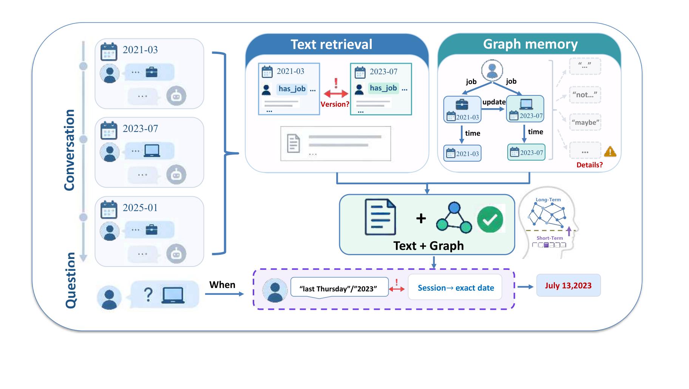
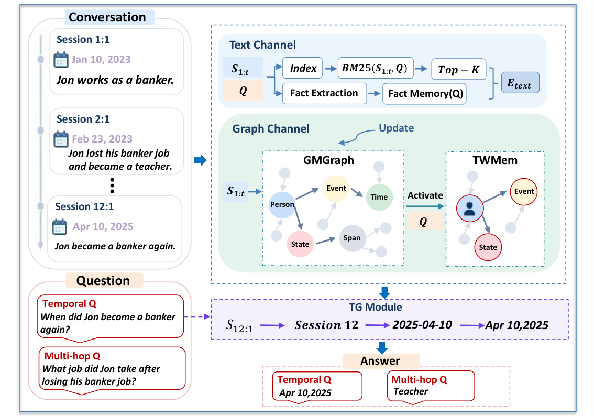

# HiGraphMem

HiGraphMem is a dual-channel memory framework for long-horizon, multi-session dialogue QA. It combines provenance-preserving text evidence, a grounded long--short-term graph memory, and temporal grounding. This repository is self-contained for the LoCoMo experiments reported in the paper.

## Motivation

<p align="center">
  <a href="figures/taste_last.pdf"></a>
</p>

## Model overview

<p align="center">
  <a href="figures/model.pdf"></a>
</p>

## Setup

```bash
python -m pip install -r requirements.txt
python scripts/smoke_test.py
```

## LoCoMo dataset

The official dataset is available from [snap-research/locomo](https://github.com/snap-research/locomo). A fresh clone needs `data/locomo/data/locomo10.json` and the official evaluator:

```bash
git clone --depth 1 https://github.com/snap-research/locomo.git /tmp/locomo
mkdir -p data/locomo
cp -a /tmp/locomo/data data/locomo/
cp -a /tmp/locomo/task_eval data/locomo/
```

## Provider configuration

Create local provider files from the empty template, then fill in your own OpenAI-compatible proxy URL and API key. Real provider files are ignored by Git.

```bash
cp configs/provider.example.yaml configs/provider.yaml
cp configs/provider.example.yaml configs/provider_qwen.yaml
```

## Paper main experiments

```bash
# GPT-4o-mini
bash scripts/runs/run_paper_main_locomo.sh \
  --backbone gpt4o-mini --name paper_gpt4omini_full \
  --jobs 1 --max-retries 10 --retry-sleep 10

# Qwen2.5-14B
bash scripts/runs/run_paper_main_locomo.sh \
  --backbone qwen25-14b --name paper_qwen25_14b_full \
  --jobs 1 --max-retries 10 --retry-sleep 10
```

`--jobs` controls concurrent conversation shards: `--jobs 1` runs sequentially, while larger values run that many conversations in parallel. Select it according to the provider's concurrency and TPM quota.

## Paper ablations

```bash
# GPT-4o-mini: channel, text, and graph-internal ablations
bash scripts/runs/run_paper_ablations_locomo.sh \
  --backbone gpt4o-mini --prefix paper_gpt4omini \
  --jobs 1 --max-retries 10 --retry-sleep 10

bash scripts/runs/run_paper_ablations_locomo.sh \
  --backbone qwen25-14b --prefix paper_qwen25_14b \
  --jobs 1 --max-retries 10 --retry-sleep 10
```

| Variant | Flag | GPT-4o-mini | Qwen2.5-14B |
| --- | --- | :---: | :---: |
| Text-only baseline | `--plain-text-rag` | yes | yes |
| w/o Text Channel | `--graph-only-update-ablation` | yes | yes |
| w/o Graph Channel | `--disable-graph` | yes | yes |
| w/o TG Module | `--disable-temporal-resolver` | yes | yes |
| w/o BM25 | `--disable-bm25` | yes | yes |
| w/o Fact Memory | `--disable-fact-memory` | yes | yes |
| w/o TWMem | `--disable-twmem` | yes | not reported |
| w/o Update | `--disable-update` | yes | not reported |
| w/o Gated Activation | `--disable-gated-activation` | yes | not reported |

To run an individual variant, use `run_full_locomo.sh` and append its flag. For example, the GPT-4o-mini TG ablation is:

```bash
bash scripts/runs/run_full_locomo.sh \
  --name paper_gpt4omini_wo_tg_module \
  --model gpt-4o-mini --model-label GPT-4o-mini \
  --method-label "HiGraphMem w/o TG Module" \
  --provider-config configs/provider.yaml \
  --jobs 1 --max-retries 10 --retry-sleep 10 \
  --disable-temporal-resolver
```

## Outputs and experiment logs

For a run named `NAME`, the runner retains:

```text
experiments/results/NAME.json
experiments/results/NAME_official_eval.json
experiments/results/NAME_token_usage.json
experiments/results/NAME_shards/conv_0.json ... conv_9.json
experiments/logs/NAME/conv_0.log ... conv_9.log
```

Completed results are in [experiments/results/](experiments/results/) and raw run logs are in [experiments/logs/](experiments/logs/). Logs are suitable for GitHub hosting after a credential check.
